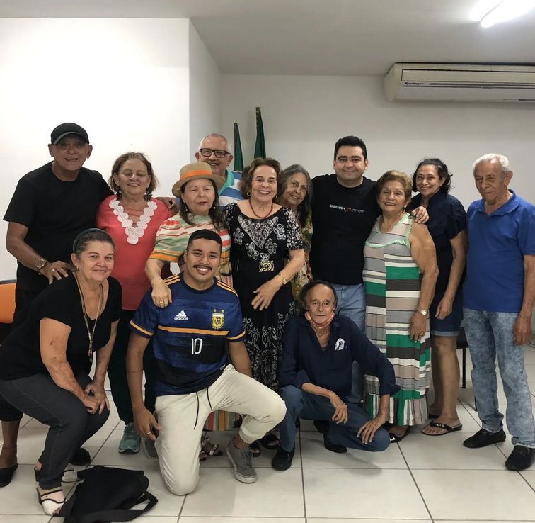

Atuou como professor voluntário de teatro no PAI (Programa de Ação Integrada para o Aposentado), no ano de 2024. A ação formativa culminou na montagem "Barro Cru", encenada no Teatro José de Alencar, a qual contou com direção de Rafael Semino e texto de Walden Luiz.

(../../media/images/action-prof-aceleracao/action-prof-aceleracao-001.png)

(../../media/images/action-prof-aceleracao/action-prof-aceleracao-001.png)

