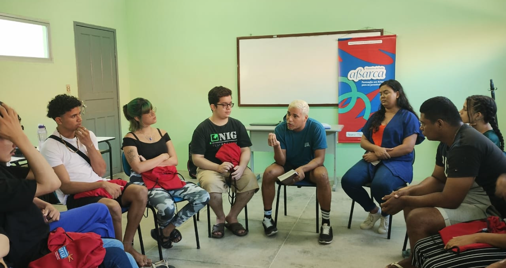
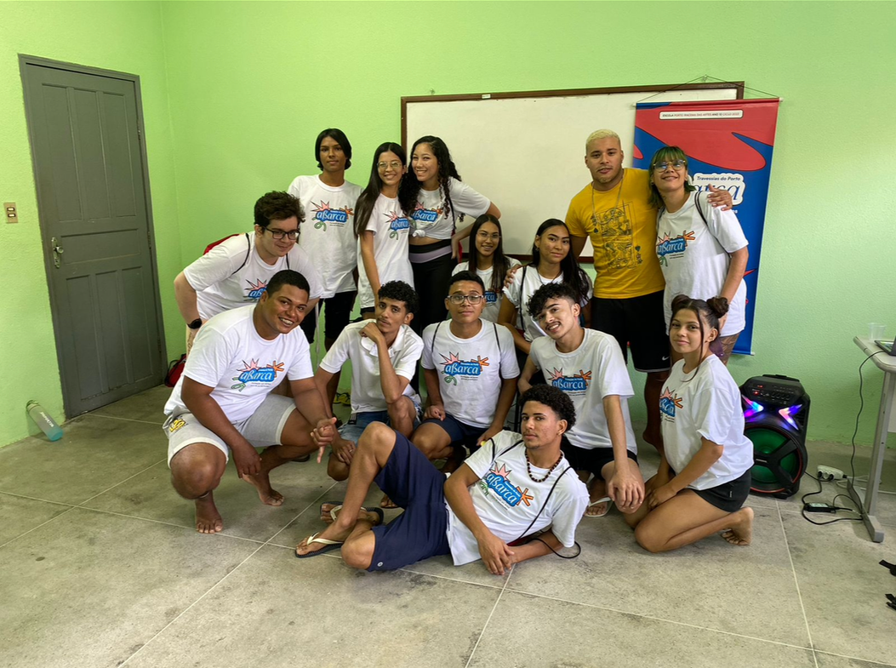
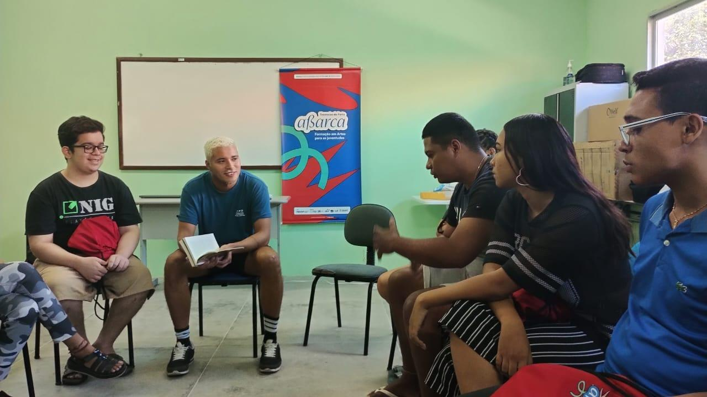
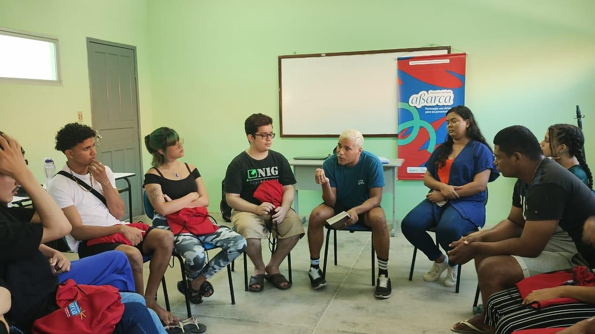

Atuação como professor do Projeto Abarca e do Percurso Básico de Teatro, desenvolvendo processos pedagógicos voltados à formação artística em diferentes territórios, incluindo Itapipoca, Vicente Pinzón e Genibaú.

