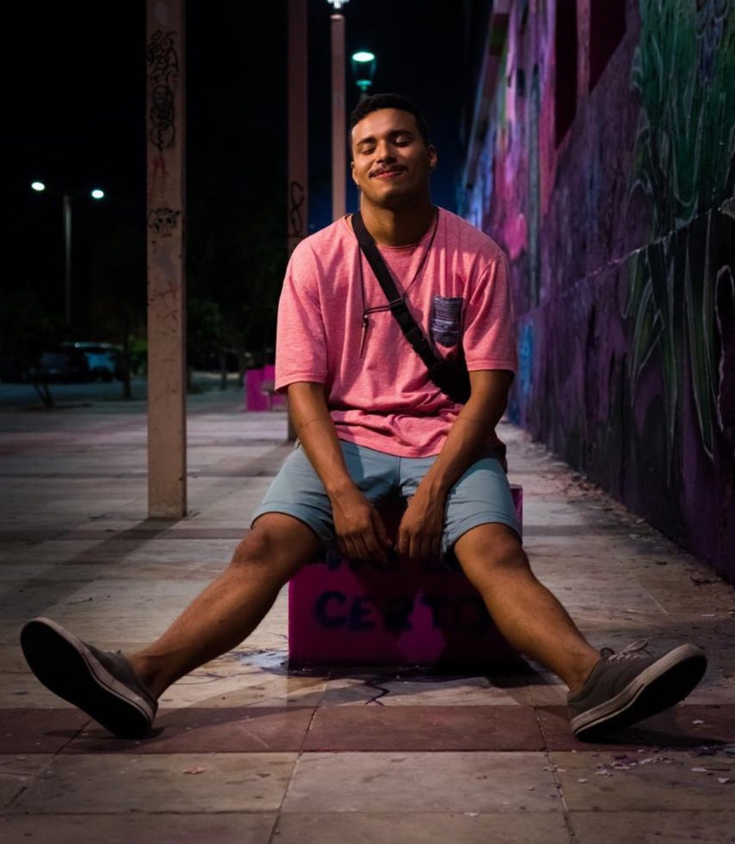

---
attachments:
- caption: 'Registro Documental: Projeto Angola Bie'
  role: documentation
  src: participation-projeto-angola-bie-001.jpeg
  type: image
date_end: '2018-11-30'
date_start: '2018-10-01'
description: Atuação como professor voluntário de Artes e Cinema em Angola, Província
  do Bié.
id: action-rafael-ensino-angola-2018
kind: formacao
my_role: Professor e Produtor
performed_by: '[[agent-rafael-semino]]'
title: Ensino de Artes e Cinema em Angola
work_id: ''
context_label: Intercâmbio Cultural e Educativo em Angola
context_kind: outro
context_location: Província do Bié, Angola
context_year: 2018
---

Ministração de cursos de teatro e cinema e atuação na Escola Sebastiana Garcia.

