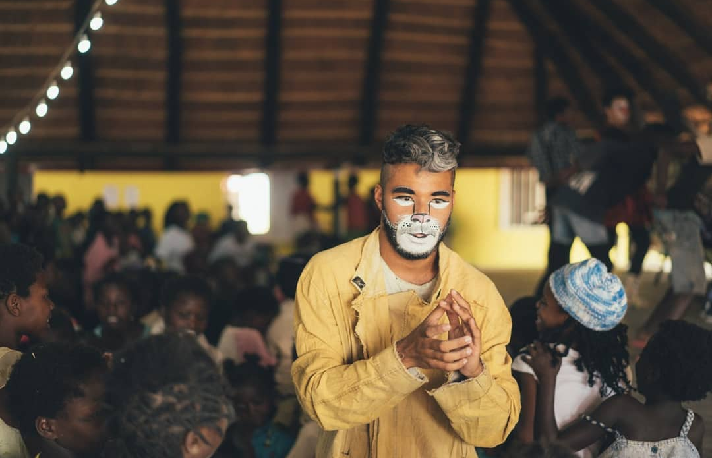
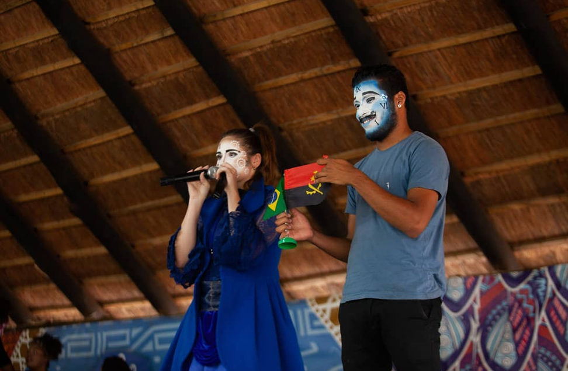
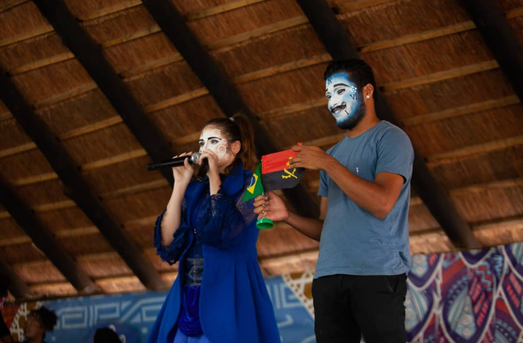
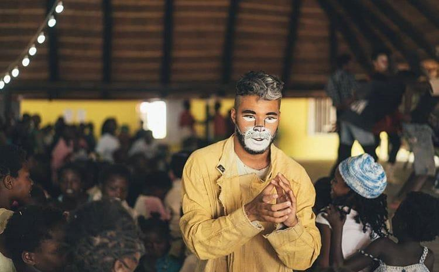
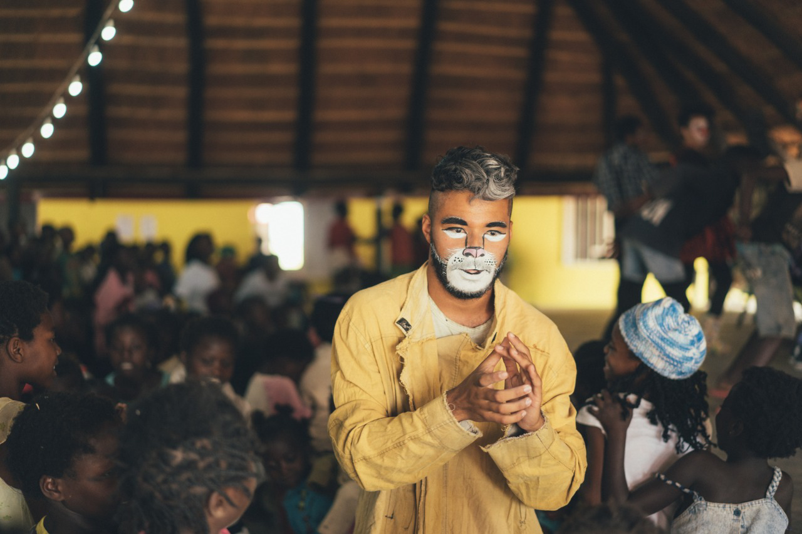

Ministração de cursos de teatro e cinema e atuação na Escola Sebastiana Garcia.

(../../media/images/action-rafael-ensino-angola-2018/action-rafael-ensino-angola-2018-001.png)

(../../media/images/action-rafael-ensino-angola-2018/action-rafael-ensino-angola-2018-002.png)

(../../media/images/action-rafael-ensino-angola-2018/action-rafael-ensino-angola-2018-003.png)

(../../media/images/action-rafael-ensino-angola-2018/action-rafael-ensino-angola-2018-004.jpeg)

(../../media/images/action-rafael-ensino-angola-2018/action-rafael-ensino-angola-2018-005.png)

(../../media/images/action-rafael-ensino-angola-2018/action-rafael-ensino-angola-2018-001.png)
(../../media/images/action-rafael-ensino-angola-2018/action-rafael-ensino-angola-2018-002.png)
(../../media/images/action-rafael-ensino-angola-2018/action-rafael-ensino-angola-2018-003.png)
(../../media/images/action-rafael-ensino-angola-2018/action-rafael-ensino-angola-2018-004.jpeg)
(../../media/images/action-rafael-ensino-angola-2018/action-rafael-ensino-angola-2018-005.png)

