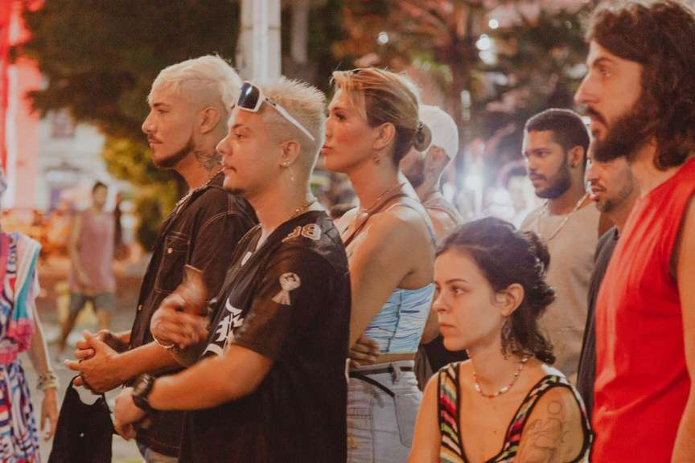
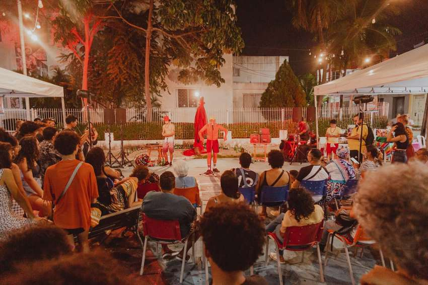
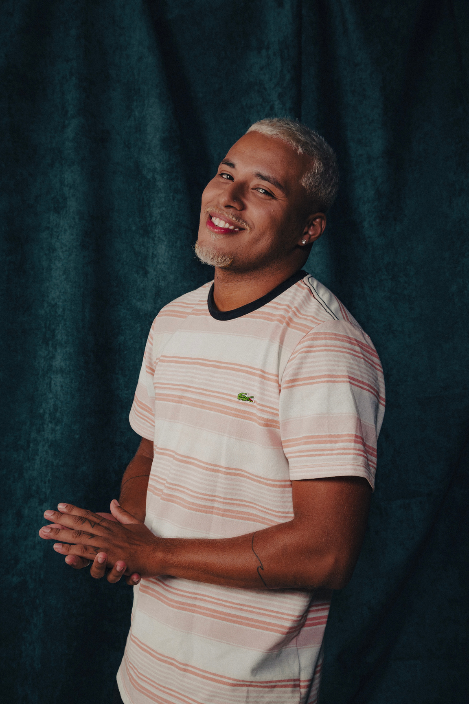
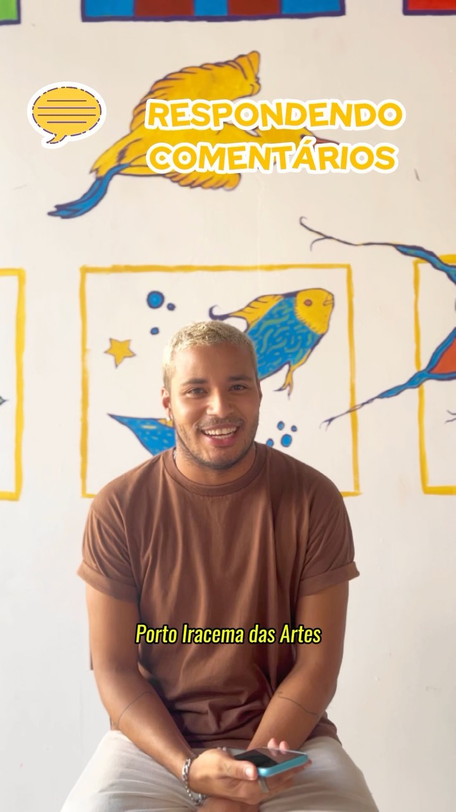
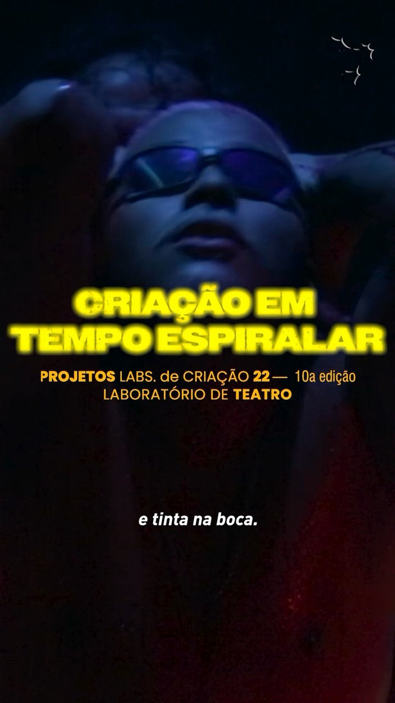
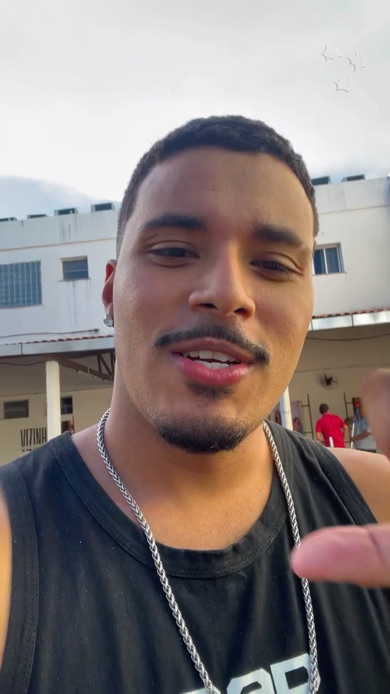
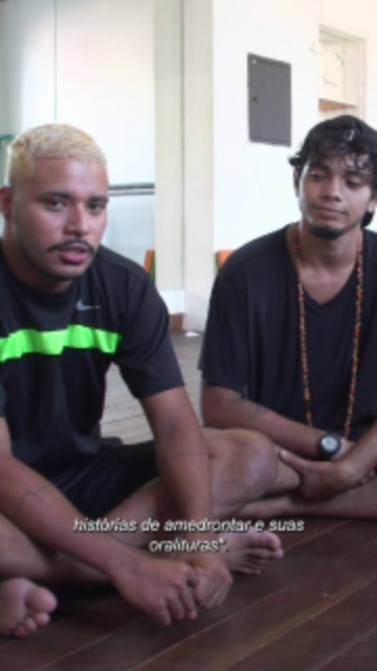

Participação como pesquisador e aluno no Laboratório de Criação da Escola Porto Iracema das Artes, com carga horária de 346 horas, desenvolvendo a pesquisa "Criação em tempo espiralar: Exu e suas encruzilhadas".

