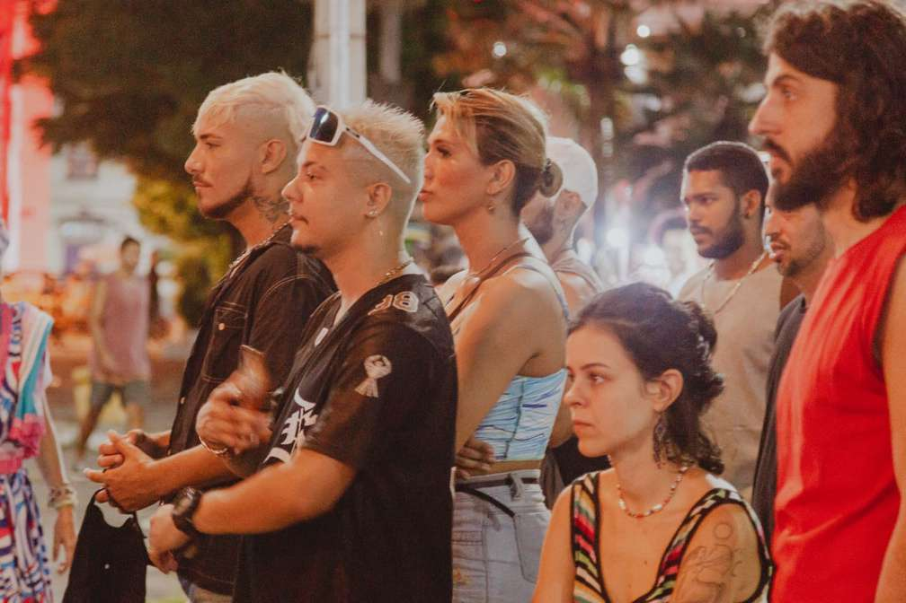
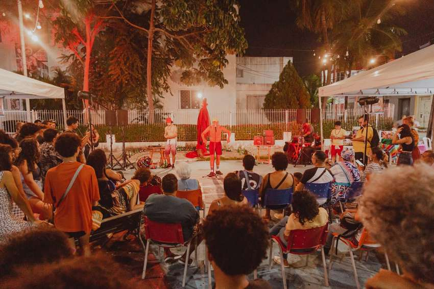
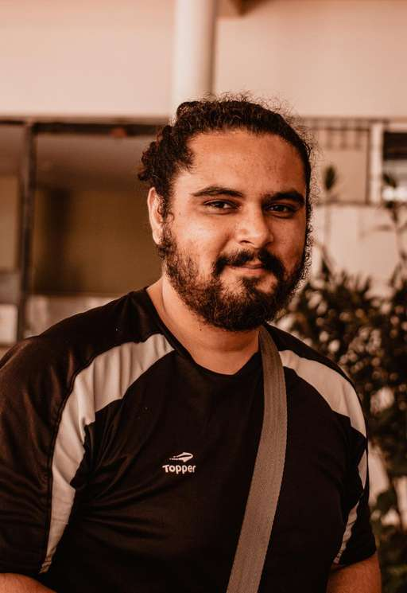
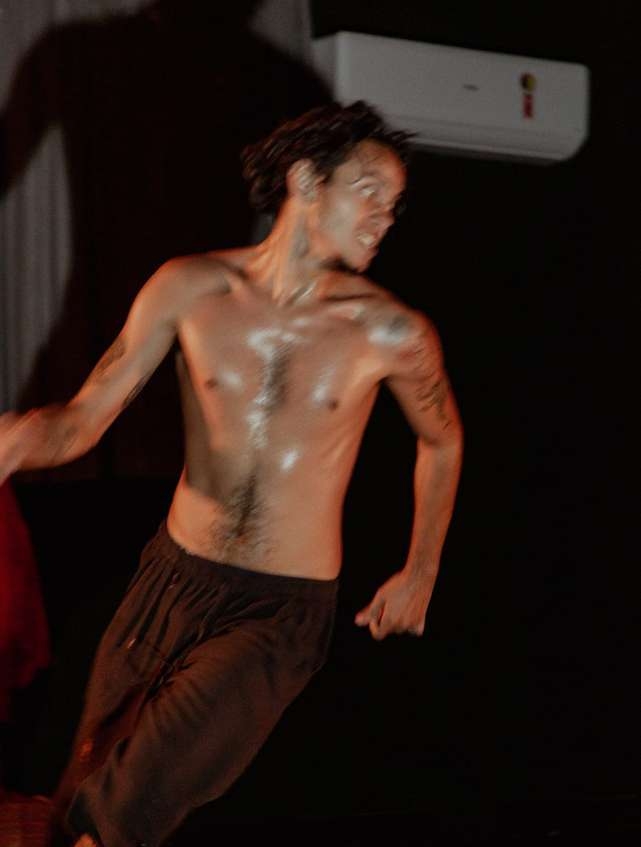
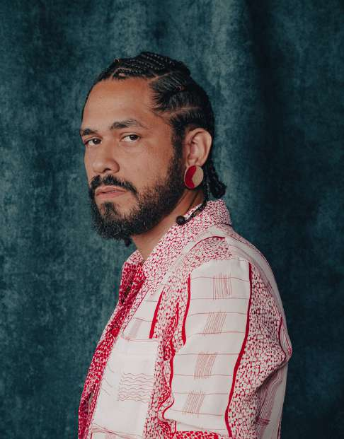

O Coletivo Farol Novo, fundado em 2022 por Rafael Semino e Gabriel França dentro do Laboratório de Criação em Teatro da Escola Porto Iracema das Artes, é uma articulação entre teatro, rito e oralidade. Atualmente o núcleo é composto por Rafael Semino e Felipe Marques.

O grupo surgiu com o intuito de desenvolver uma peça ("Exu não vem hoje") que abordasse questões sobre o tempo, mito e oralidade, trazendo à cena uma estética imersa na periferia. Ainda durante os ensaios de "Exu", o estudante de teatro Felipe Marques ingressou no grupo para assumir inicialmente atividades técnicas. A linguagem do coletivo rapidamente se expandiu para investigar a relação de Exu com o sagrado, testando a musicalidade como potência criadora.

Em 2023, após vencerem o prêmio "Amarrações Estéticas" da Escola Porto Iracema, o Coletivo convidou Zeis (que na época estava no Laboratório de Música com o projeto "Encruzilhada") para integrar o grupo definitivo. A chegada de Zeis, com sua pesquisa sobre mitos e uma narrativa musical inédita, culminou na criação e elaboração do espetáculo "Vão". 

Hoje, celebrando seus três primeiros anos de vida, o Coletivo Farol Novo é marcado pelo desejo profundo de conceber dramaturgias coletivas e um teatro que dissolva a barreira entre palco e plateia, onde os espectadores convergem ativamente com os atores.

