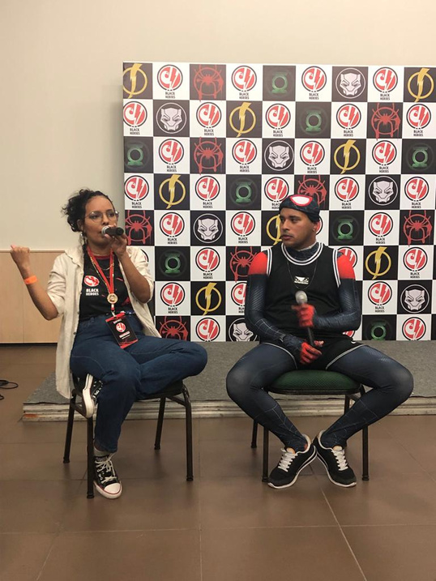
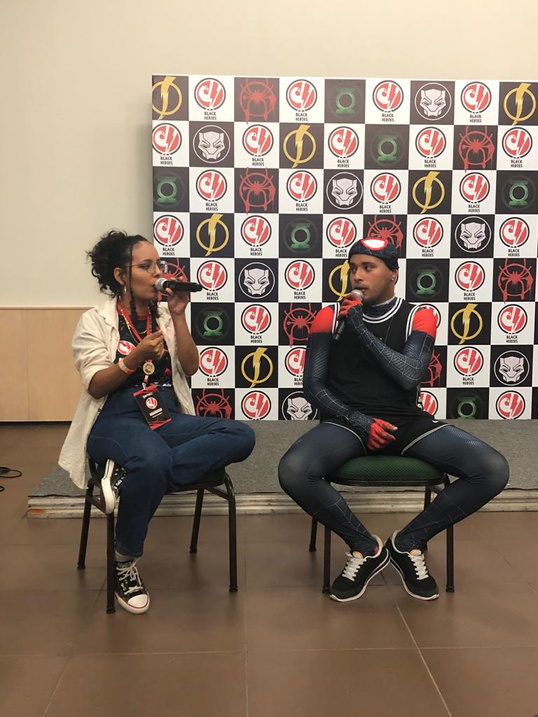
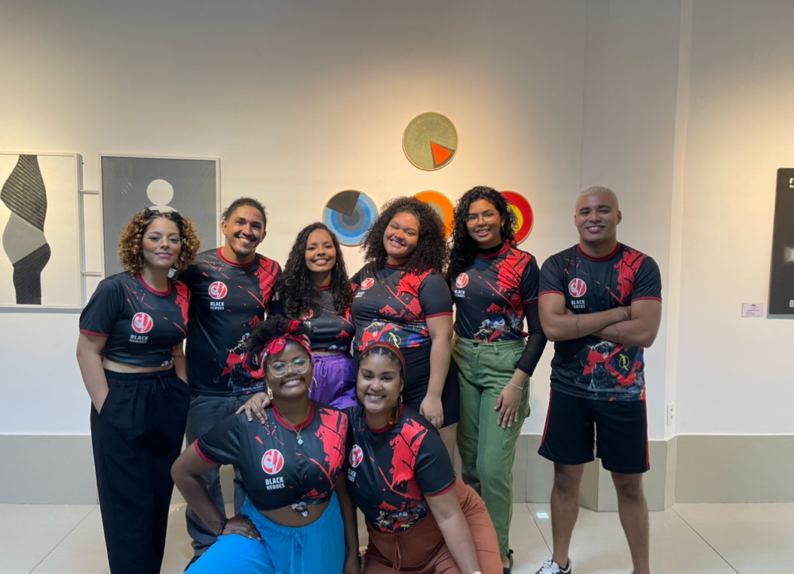

Francisco Rafael da Silva Semino atua há mais de dez anos no campo das artes cênicas como Ator, Diretor, Dramaturgo, Produtor, Pesquisador e Professor de Teatro.

### Trajetória e Perfil Artístico
Minha trajetória articula **criação artística, pesquisa acadêmica e práticas pedagógicas** como campos indissociáveis. Atuo no teatro entendendo a cena como espaço de pensamento, rito contemporâneo e dispositivo político-pedagógico. Desenvolvo investigações continuadas sobre **mito, oralidade, tempo e ancestralidade afro-brasileira**, com especial atenção à figura de Exu como princípio dramatúrgico, filosófico e relacional.

Meu trabalho se constrói em processos coletivos, atravessando espetáculos, livros, ações pedagógicas e projetos audiovisuais. Meus eixos de atuação artística compreendem:
- Teatro e performance
- Direção e dramaturgia
- Pesquisa de teatro
- Ensino e mediação cultural

Também atua como Produtor Cultural e Coordenador da Área de Formação e Ensino no coletivo Black Heroes.

### Graduação e Titulações Pessoais
Graduado em Licenciatura em Teatro (2022) pelo Instituto Federal de Ciência, Educação e Tecnologia do Ceará (IFCE), e Mestre em Artes pela UFC (Universidade Federal do Ceará, 2023), com ênfase em teatro, pedagogia do corpo, ritual e ancestralidade. Atualmente cursando a especialização em Teatro do Oprimido pela UFBA (Universidade Federal da Bahia).

### Ação Pedagógica e Pesquisa
Sua trajetória profissional abrange forte atuação no ensino de teatro e artes em escolas municipais e estaduais (Escola Mário Hugo Sadrak do Vale, Escola Paulo Petrola, Escola Dom Helder Câmara, etc). Atuou como professor de Artes do Projeto Abarca e do Percurso Básico de Teatro pela Escola Porto Iracema das Artes, promovendo laboratórios de formação em Fortaleza e municípios vizinhos (Itapipoca, Vicente Pinzón e Genibaú).

### Audiovisual e Criação Literária
Além do palco, Rafael acumula experiências como roteirista, produtor, assistente de produção e de direção audiovisual. É também autor da obra literária/infantil "Contos de Exu", que derivou das experimentações cênicas e investigações do corpo e ancestralidade forjados dentro do Laboratório de Criação Cênica em 2022.

