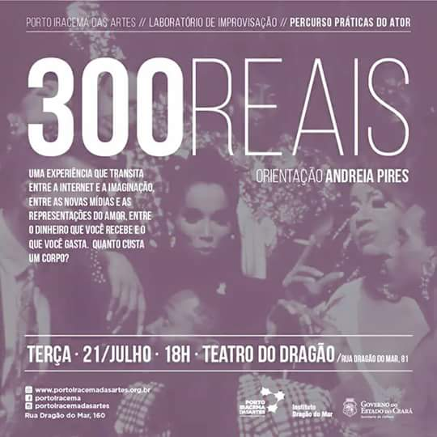

**300 Reais** foi uma peça teatral concebida a partir do curso "Corpo e Movimento" (45h), realizado na Escola Porto Iracema das Artes em 2015.

A direção da obra foi de Andrea Pires, e Rafael Semino atuou como parte do elenco, inserindo-se em seu percurso de práticas do ator.

