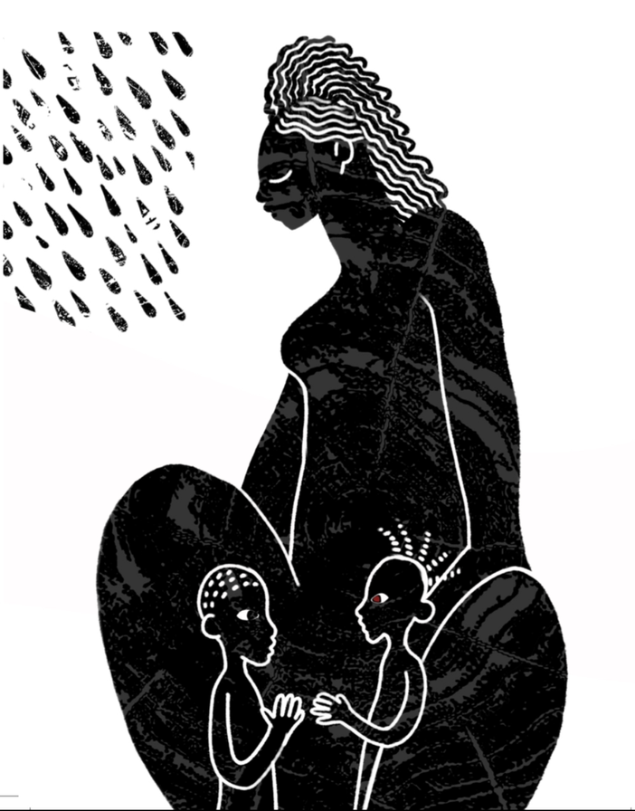
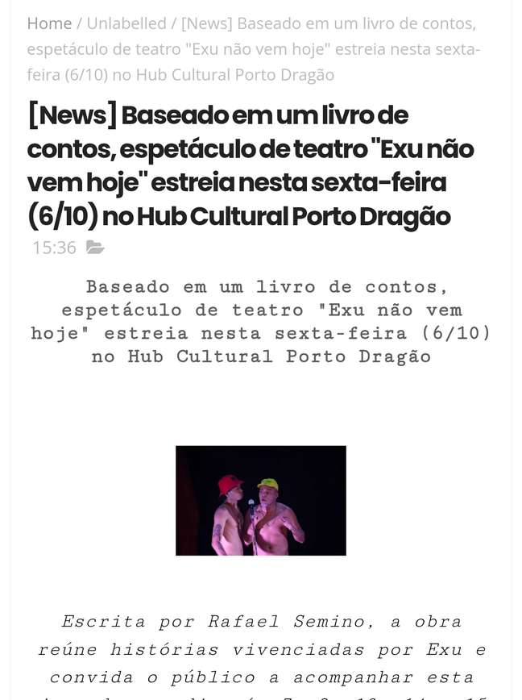

---
attachments:
  - caption: 'Registro Documental: Contos De Exu'
    role: documentation
    src: work-contos-de-exu-002.png
    type: image
  - caption: 'Registro Documental: Contos De Exu'
    role: documentation
    src: work-contos-de-exu-003.png
    type: image
  - caption: 'Registro Documental: Contos De Exu'
    role: documentation
    src: work-contos-de-exu-001.jpeg
    type: image
description: Livro resultante do Laboratório do Porto Iracema dando contornos práticos à pesquisa de mestrado da UFC.
id: work-contos-de-exu
title: Contos de Exu
type: teatro
year: 2022
---

Projeto desenvolvido no Laboratório de Criação em Teatro da Escola Porto Iracema das Artes em 2022. O livro foi um dos desdobramentos artísticos que deram vida prática à pesquisa de mestrado de Rafael Semino pela UFC (Universidade Federal do Ceará), resultando na publicação da obra focada na oralidade e no mito de Exu.

Quatro contos baseados em escrevivências e itãs de Exu, consolidando a investigação sobre a corporeidade e a ancestralidade afro-brasileira.

