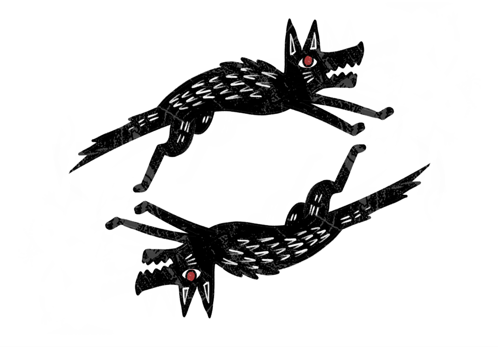

Projeto desenvolvido no Laboratório de Criação em Teatro da Escola Porto Iracema das Artes em 2022. O livro foi um dos desdobramentos artísticos que deram vida prática à pesquisa de mestrado de Rafael Semino pela UFC (Universidade Federal do Ceará), resultando na publicação da obra focada nas oralituras e escrevivências do artista e dos itãs de Exu criando uma relação entre a cosmologia exuística e suas vivencias.

Quatro contos baseados em escrevivências e itãs de Exu, consolidando a investigação sobre a corporeidade e a ancestralidade afro-brasileira.

