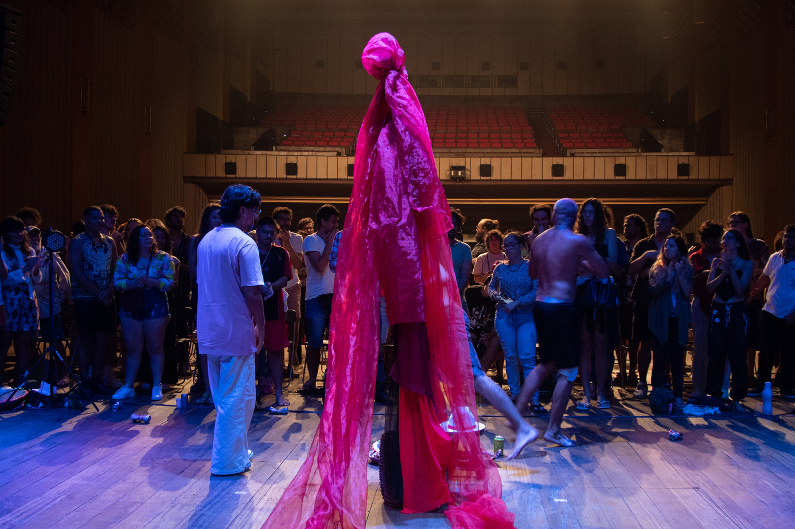
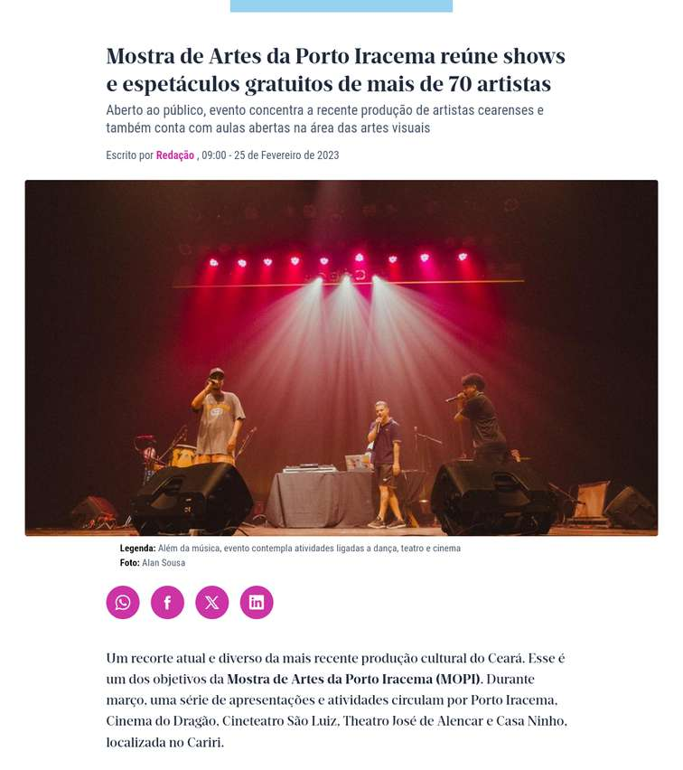
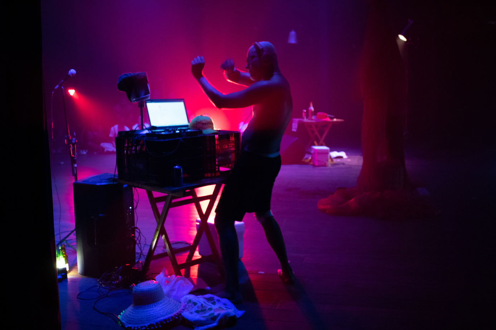
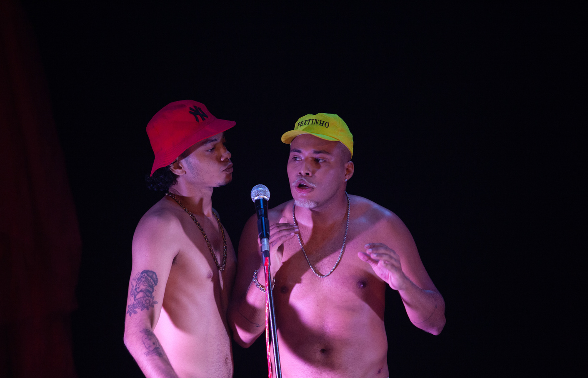
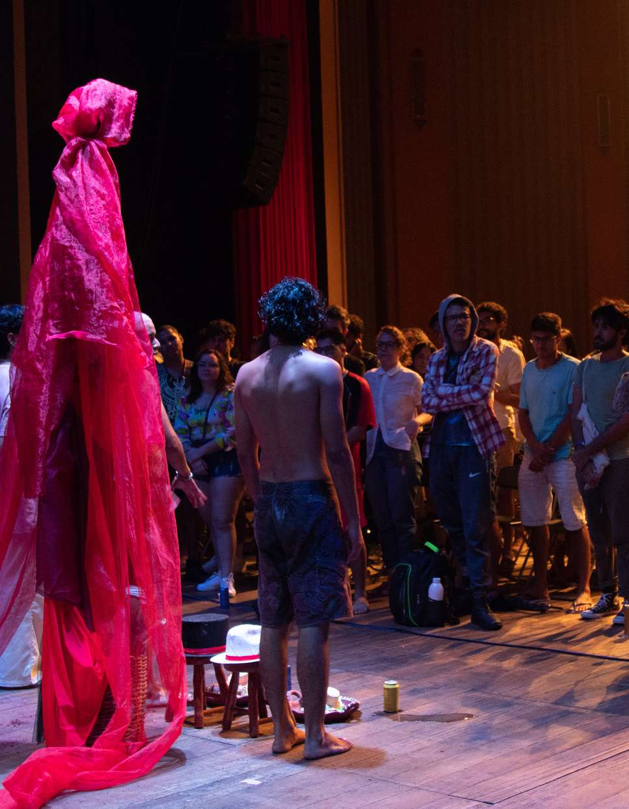

---
attachments:
- caption: 'Registro Documental: Exu Nao Vem Hoje'
  role: documentation
  src: work-exu-nao-vem-hoje-006.png
  type: image
- caption: 'Registro Documental: Exu Nao Vem Hoje'
  role: documentation
  src: work-exu-nao-vem-hoje-003.jpeg
  type: image
- caption: 'Registro Documental: Exu Nao Vem Hoje'
  role: documentation
  src: work-exu-nao-vem-hoje-009.jpeg
  type: image
- caption: 'Registro Documental: Exu Nao Vem Hoje'
  role: documentation
  src: work-exu-nao-vem-hoje-002.jpeg
  type: image
- caption: 'Registro Documental: Exu Nao Vem Hoje'
  role: documentation
  src: work-exu-nao-vem-hoje-001.jpeg
  type: image
- caption: 'Registro Documental: Exu Nao Vem Hoje'
  role: documentation
  src: work-exu-nao-vem-hoje-005.png
  type: image
- caption: 'Registro Documental: Exu Nao Vem Hoje'
  role: documentation
  src: work-exu-nao-vem-hoje-008.jpeg
  type: image
- caption: 'Registro Documental: Exu Nao Vem Hoje'
  role: documentation
  src: work-exu-nao-vem-hoje-010.jpeg
  type: image
- caption: 'Registro Documental: Exu Nao Vem Hoje'
  role: documentation
  src: work-exu-nao-vem-hoje-004.jpeg
  type: image
- caption: 'Registro Documental: Exu Nao Vem Hoje'
  role: documentation
  src: work-exu-nao-vem-hoje-007.jpeg
  type: image
description: Peça teatral apresentada ao final do Laboratório do Porto Iracema, transpondo
  a pesquisa de mestrado para o palco.
id: work-exu-nao-vem-hoje
title: Exu Não Vem Hoje
type: teatro
year: 2022
---

Espetáculo teatral criado a partir do processo de pesquisa desenvolvido por Rafael Semino no Laboratório de Criação em Teatro da Escola Porto Iracema das Artes, em diálogo com sua investigação em torno de Exu, oralidade e presença cênica. A obra articula rito, jogo e participação do público, tendo Rafael Semino como autor e intérprete, em processo de criação coletiva.

A peça mergulha na força matriz e nos rastros arquetípicos de Exu, propondo uma encenação que foge do palco tradicional: o público não é mero observador, mas é intensamente convidado à participação coletiva. Os espectadores assumem personagens, dançam e dissolvem ativamente a barreira física com os atores.

A gestação do projeto ocorreu no interior do Laboratório de Criação Cênica da Escola Porto Iracema das Artes (2022). O processo criativo também pavimentou as bases técnicas periféricas do coletivo, integrando Felipe Marques na operação profunda de som e luz, configurando um ambiente teatral vivo e pulsante.

**Circulação:**
- Escola Porto Iracema das Artes – apresentação única
- Cine Teatro São Luís – apresentação única
- Hub Cultural Porto Dragão – temporada
- Festival Nordestino de Teatro de Guaramiranga – apresentação única

