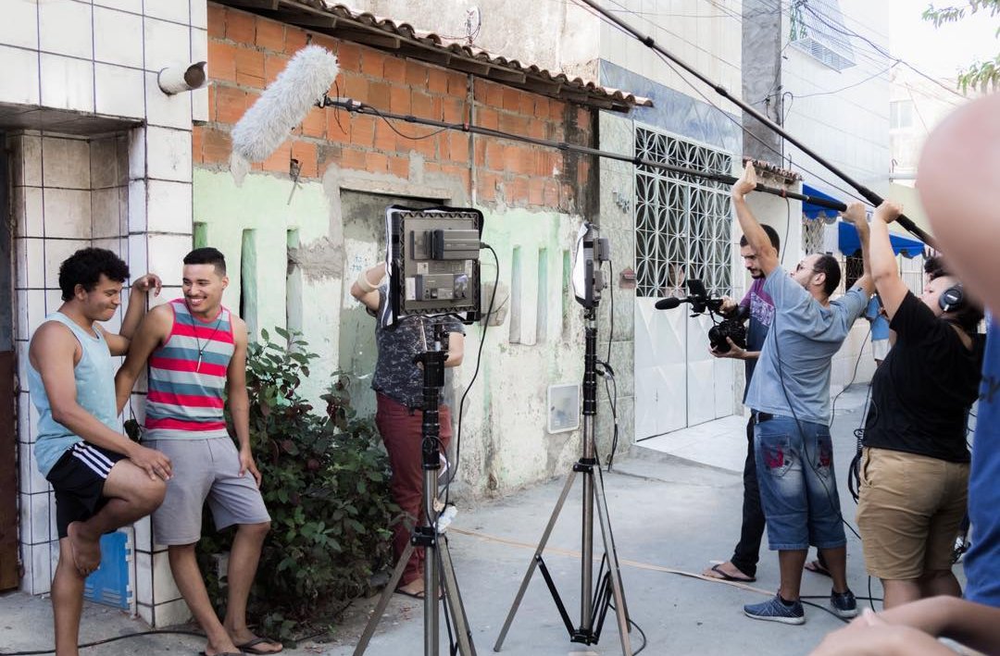
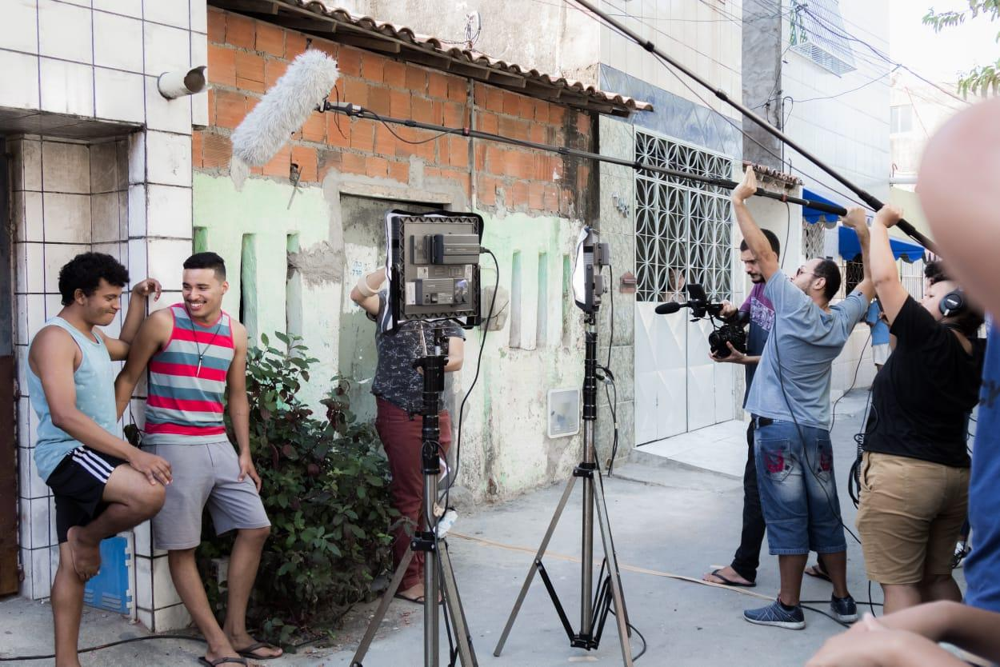

Produção audiovisual independente explorando poéticas visuais. Rafael Semino tem experiência em atuação audiovisual sob direção de Jennifer Vieira (2019).

Na periferia de Fortaleza, Júlia se divide entre ajudar a família, estudar e trabalhar ao mesmo tempo que enfrenta os questionamentos de uma juventude atravessada pela violência.

[Saiba mais sobre o curta "Há números que sonham"](https://portoiracemadasartes.org.br/iii-mostra-filmes-da-porto-apresenta-oito-curtas-metragens-do-preamar-2022/)

(../../media/images/work-ha-numeros-que-sonham/work-ha-numeros-que-sonham-001.jpeg)

(../../media/images/work-ha-numeros-que-sonham/work-ha-numeros-que-sonham-002.png)

(../../media/images/work-ha-numeros-que-sonham/work-ha-numeros-que-sonham-003.png)

(../../media/images/work-ha-numeros-que-sonham/work-ha-numeros-que-sonham-004.jpeg)

(../../media/images/work-ha-numeros-que-sonham/work-ha-numeros-que-sonham-005.jpeg)

(../../media/images/work-ha-numeros-que-sonham/work-ha-numeros-que-sonham-001.jpeg)
(../../media/images/work-ha-numeros-que-sonham/work-ha-numeros-que-sonham-002.png)
(../../media/images/work-ha-numeros-que-sonham/work-ha-numeros-que-sonham-003.png)
(../../media/images/work-ha-numeros-que-sonham/work-ha-numeros-que-sonham-004.jpeg)
(../../media/images/work-ha-numeros-que-sonham/work-ha-numeros-que-sonham-005.jpeg)

