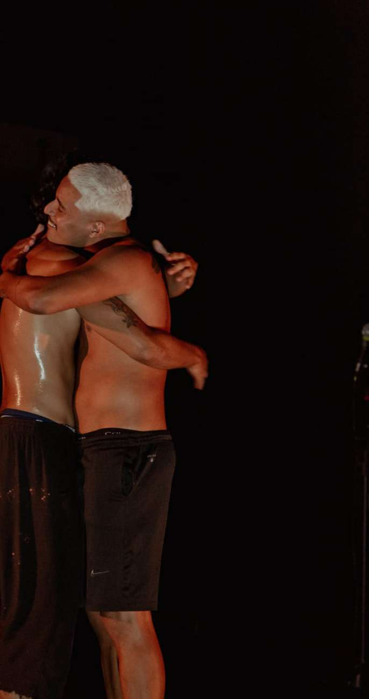
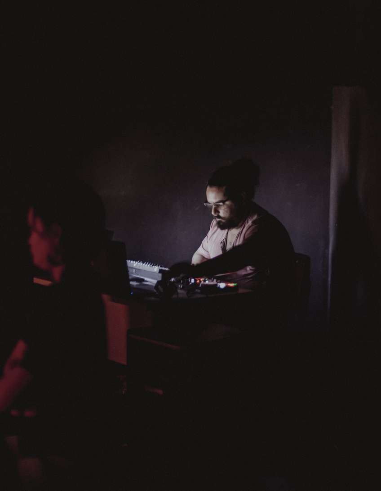
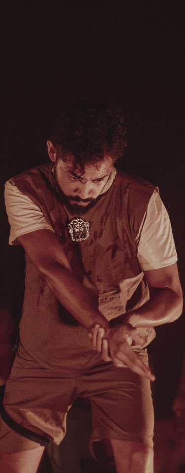
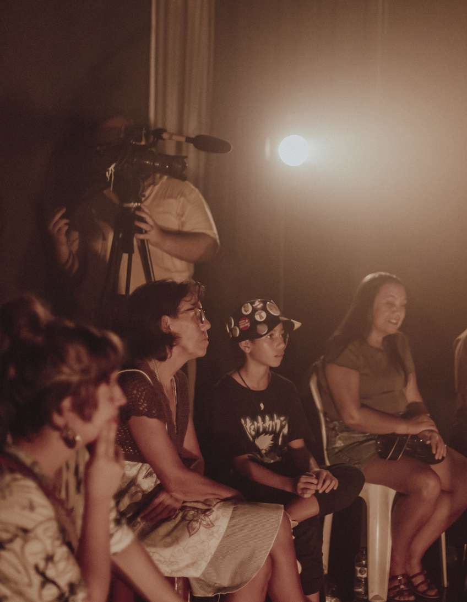
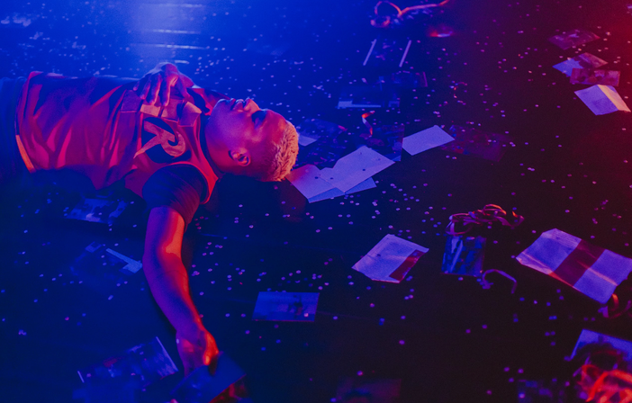
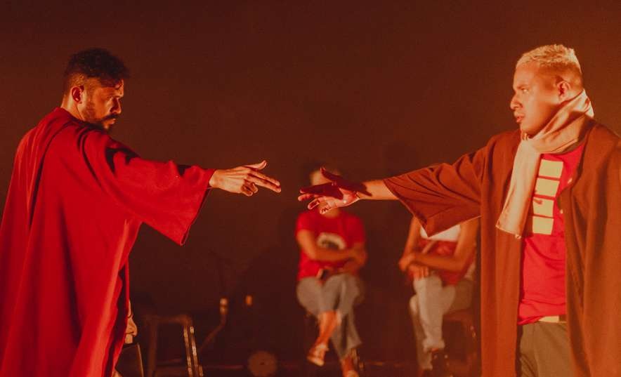
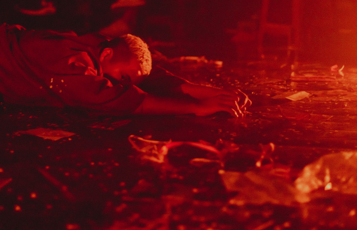
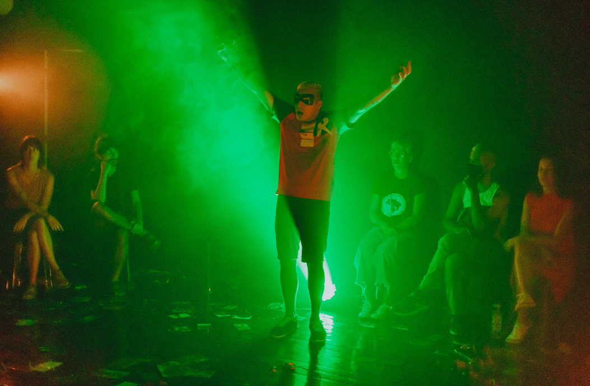

---
attachments:
- caption: 'Registro Documental: Vao'
  role: documentation
  src: work-vao-005.jpeg
  type: image
- caption: 'Registro Documental: Vao'
  role: documentation
  src: work-vao-001.jpeg
  type: image
- caption: 'Registro Documental: Vao'
  role: documentation
  src: work-vao-008.png
  type: image
- caption: 'Registro Documental: Vao'
  role: documentation
  src: work-vao-003.jpeg
  type: image
- caption: 'Registro Documental: Vao'
  role: documentation
  src: work-vao-004.jpeg
  type: image
- caption: 'Registro Documental: Vao'
  role: documentation
  src: work-vao-007.png
  type: image
- caption: 'Registro Documental: Vao'
  role: documentation
  src: work-vao-006.jpeg
  type: image
- caption: 'Registro Documental: Vao'
  role: documentation
  src: work-vao-010.png
  type: image
- caption: 'Registro Documental: Vao'
  role: documentation
  src: work-vao-009.png
  type: image
- caption: 'Registro Documental: Vao'
  role: documentation
  src: work-vao-002.jpeg
  type: image
description: Espetáculo nascido do cruzamento entre teatro e música dentro da escola
  Porto Iracema (Prêmio Amarrações Estéticas).
id: work-vao
title: Vão
type: teatro
year: 2023
---

Espetáculo nascido do cruzamento interdisciplinar fomentado pelo Prêmio "Amarrações Estéticas" da Escola Porto Iracema das Artes, em 2023.

A gênese de "Vão" ocorreu quando Zeis (Músico), que estava desenvolvendo o projeto sonoro "Encruzilhada" no Laboratório de Música, foi convidado para integrar o Coletivo Farol Novo, que acabara de gestar "Exu Não Vem Hoje". 

O encontro revelou interesses dramatúrgicos profundos em comum: as investigações sobre o tempo e a presença dos mitos. Da fusão dessa dramaturgia periférica do teatro com as canções prévias e inéditas de Zeis, materializou-se a obra cênico-musical "Vão", que consolidou a nova formação permanente do Coletivo.

